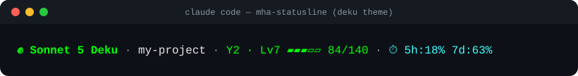
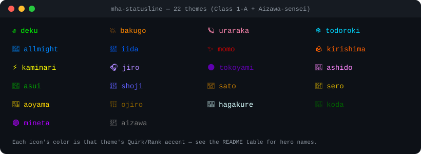

# mha-statusline

A [Claude Code](https://claude.com/claude-code) statusline themed after **My Hero
Academia** — pure PowerShell, zero dependencies. No Node.js, no npm, no jq, no
admin rights. Works on any locked-down Windows machine where PowerShell is the
only thing you're guaranteed to have. Not on Claude Code? It also installs as
a plain terminal-prompt hook — see [Using it with Codex, other AI CLIs, or a
local LLM](#using-it-with-codex-other-ai-clis-or-a-local-llm).

One line, kept minimal:

<p align="center"></p>

## What it shows

| Segment | Meaning | Source |
|---|---|---|
| 💥 Quirk | Model name + the character's hero name (icon/name vary by [theme](#themes) — ✊ Deku for Deku, shown above) | `model.display_name` |
| Agency | Current folder name | `workspace.current_dir` |
| Rank | Your hero career — see [Rank](#rank-hero-career-progression) below. Skipped entirely on League of Villains themes | `rate_limits.seven_day.used_percentage` |
| ⏱ Cooldown | Rate limit usage (5h window) | `rate_limits.five_hour` |
| Motto | "Go beyond, Plus Ultra! 💪" — U.A.'s motto, always shown last in a theme-neutral magenta since it belongs to the school, not any one hero. League of Villains themes swap it for "Go beyond, Plus Chaos! 😈" instead | static |

The git branch was dropped from the line entirely (not just hidden) to keep
things minimal — see [Customizing](#customizing) if you want it back.

Every field is optional — if Claude Code's statusline payload doesn't include it
(older CLI version, different plan), that segment is just skipped. The script
never throws: worst case it prints just the model name. Context-remaining %,
session cost, and lines-added/removed are intentionally left off the line to
keep it minimal — they're still in `settings.json`'s statusline payload if you
want to add a field back in [Customizing](#customizing).

## Rank: hero career progression

A small companion feature inspired by [Claudemon](https://github.com/zamarrowski/claudemon):
your own hero career rises and falls with how hard you're using Claude Code
*this week*, shown as `<stage> · Lv<N>`. Unlike Claudemon there's no
catching/battling, and unlike a typical XP grind there's nothing to
accumulate forever — it's a live gauge, not a savings account:

| Level | Shown as |
|---|---|
| 1-4 | `Y1` |
| 5-9 | `Y2` |
| 10-14 | `Y3` |
| 15-19 | `License` |
| 20-29 | `Sidekick` |
| 30-39 | `Agency Founder` |
| 40+ | `#300`…`#1` — the JP Hero Billboard Chart, a numeric rank that counts down as you level, reaching **#1** (Symbol of Peace) at level 100 |

Level is computed straight from `rate_limits.seven_day.used_percentage` — the
same weekly rate-limit usage Claude Code already reports — mapped so 0% is
Lv1 and 100% is Lv100. The Lv40-100 countdown to `#1` isn't linear: it's a
brisk, even climb from `#300` down to `#10` across Lv40-95, then a curve
for the last ten ranks (Lv95-100) that gets progressively steeper the
closer you get to `#1`, so the ranks that matter most stay distinguishable
down to a fraction of a level instead of bunching up right before 100%. No
state file, no hook, no accumulation: it's recalculated fresh on every
statusline render — using the full decimal precision Claude Code reports,
not a rounded whole number — so it tracks your *current* 7-day window and
eases back down as that window rolls over. Missing rate-limit data (older
CLI, or a plan without them) just shows Lv1. League of Villains themes
skip this whole segment: a villain was never climbing U.A.'s ladder or the
Hero Billboard Chart, so there's no rank of theirs for weekly usage to
stand in for.

## Themes

108 themes — all of Class 1-A, all 20 of Class 1-B, U.A.'s "Big 3", every
past holder of One For All, 22 U.A. faculty and named sidekick/mentor
heroes (including the Wild, Wild Pussycats), 13 pro heroes, and 22 villains
spanning the League of Villains, the Meta Liberation Army, and independent
masterminds who carried their own arc — each with its own Quirk icon, color
palette, and hero (or villain) name:

<p align="center"></p>

### Class 1-A

| Theme key | Character | Colors | Hero name |
|---|---|---|---|
| `deku` *(default)* | Deku (Midoriya Izuku) | One For All green | Deku |
| `bakugo` | Bakugo (Katsuki) | Explosion orange, olive accents | Dynamight |
| `uraraka` | Uraraka (Ochako) | Zero-gravity pink, sky-blue cooldown | Uravity |
| `todoroki` | Todoroki (Shoto) | Half ice-blue, half fire-red | Shoto |
| `iida` | Iida (Tenya) | Engine blue, recipro-burst red | Ingenium |
| `momo` | Yaoyorozu (Momo) | Creation crimson, cream belt | Creati |
| `kirishima` | Kirishima (Eijiro) | Hardened red, manly orange | Red Riot |
| `kaminari` | Kaminari (Denki) | Electric yellow | Chargezuma |
| `jiro` | Jiro (Kyoka) | Earphone-jack purple | Earphone Jack |
| `tokoyami` | Tokoyami (Fumikage) | Black robe, dark-purple tint | Tsukuyomi |
| `ashido` | Ashido (Mina) | Acid pink | Pinky |
| `asui` | Asui (Tsuyu) | Frog green | Froppy |
| `shoji` | Shoji (Mezo) | Blue tank top, indigo mask | Tentacole |
| `sato` | Sato (Rikido) | Sugar-rush brown-orange | Sugarman |
| `sero` | Sero (Hanta) | Tape gold | Cellophane |
| `aoyama` | Aoyama (Yuga) | Twinkling gold | Can't Stop Twinkling |
| `ojiro` | Ojiro (Mashirao) | Tail brown | Tailman |
| `hagakure` | Hagakure (Toru) | Barely-there white | Invisible Girl |
| `koda` | Koda (Koji) | Quiet forest green | Anima |
| `mineta` | Mineta (Minoru) | Pop-off purple | Grape Juice |
| `shinzo` | Shinzo (Hitoshi) | Brainwash violet, capture-scarf indigo | NightHide |

### Class 1-B

| Theme key | Character | Colors | Hero name |
|---|---|---|---|
| `monoma` | Monoma (Neito) | Copy mirror-cyan | Phantom Thief |
| `kendo` | Kendo (Itsuka) | Big Fist tan | Battle Fist |
| `tetsutetsu` | Tetsutetsu Tetsutetsu | Steel chrome-gray | Real Steel |
| `tokage` | Tokage (Setsuna) | Lizard Tail Splitter green | Lizardy |
| `shiozaki` | Shiozaki (Ibara) | Vines deep green | Vine |
| `kuroiro` | Kuroiro (Shihai) | Black near-black | Vantablack |
| `kamakiri` | Kamakiri (Togaru) | Razor Sharp mantis green | Jack Mantis |
| `komori` | Komori (Kinoko) | Mushroom pink | Shemage |
| `awase` | Awase (Yosetsu) | Weld spark orange | Welder |
| `bondo` | Bondo (Kojiro) | Cemedine glue tan | Plamo |
| `fukidashi` | Fukidashi (Manga) | Comic speech-bubble yellow | Comicman |
| `honenuki` | Honenuki (Juzo) | Softening mud brown | Mudman |
| `kaibara` | Kaibara (Sen) | Gyrate drill orange | Spiral |
| `kodai` | Kodai (Yui) | Size soft blue | Rule |
| `rin` | Rin (Hiryu) | Scales dragon blue | Dragon Shroud |
| `shishida` | Shishida (Jurota) | Beast feral brown | Gevaudan |
| `shoda` | Shoda (Nirengeki) | Twin Impact blast orange-red | Mines |
| `tsuburaba` | Tsuburaba (Kosei) | Solid Air pale blue | Tsuburaba |
| `tsunotori` | Tsunotori (Pony) | Horn Cannon pastel pink | Rocketti |
| `yanagi` | Yanagi (Reiko) | Poltergeist psychic purple | Emily |

### U.A.'s "Big 3"

| Theme key | Character | Colors | Hero name |
|---|---|---|---|
| `mirio` | Togata (Mirio) | Permeation gold | Lemillion |
| `tamaki` | Amajiki (Tamaki) | Manifest indigo | Suneater |
| `nejire` | Hado (Nejire) | Wave Motion blue | Nejire-chan |

### One For All lineage

Every past holder of One For All before it reached Deku, each showing off
their own original Quirk rather than One For All itself.

| Theme key | Character | Colors | Quirk |
|---|---|---|---|
| `yoichi` | Shigaraki (Yoichi), 1st user | Soft gold | Quirk Bestowal |
| `kudo` | Kudo (Toshitsugu), 2nd user | Mechanical blue-gray | Gearshift |
| `brucelee` | Bruce Lee, 3rd user | Explosive orange | Fa Jin |
| `shinomori` | Shinomori (Hikage), 4th user | Stealth purple | Danger Sense |
| `banjo` | Banjo (Daigoro), 5th user | Black-purple | Blackwhip |
| `en` | En, 6th user | Smoke purple | Smokescreen |
| `nana` | Shimura (Nana), 7th user, All Might's mentor | Warm brown | Float |

### U.A. faculty

| Theme key | Character | Colors | Hero name |
|---|---|---|---|
| `allmight` | All Might (Yagi Toshinori) | Hero-suit blue and gold | All Might |
| `aizawa` | Aizawa-sensei (Shota) | Tired gray, capture-scarf | Eraser Head |
| `presentmic` | Present Mic (Yamada Hizashi) | Radio-DJ yellow | Present Mic |
| `midnight` | Midnight (Kayama Nemuri) | Somnambulist purple | Midnight |
| `vladking` | Vlad King (Kan Sekijiro) | Blood Control dark red | Vlad King |
| `cementoss` | Cementoss (Ishiyama Ken) | Concrete gray | Cementoss |
| `powerloader` | Power Loader (Maijima Higari) | Mining-suit orange | Power Loader |
| `nezu` | Nezu | High Specs cream | Nezu |
| `recoverygirl` | Recovery Girl (Shuzenji Chiyo) | Soft pink | Recovery Girl |
| `thirteen` | Thirteen (Kurose Anan) | Black Hole void-black | Thirteen |
| `ectoplasm` | Ectoplasm | Spectral teal | Ectoplasm |
| `snipe` | Snipe | Cowboy brown | Snipe |
| `hounddog` | Hound Dog (Inui Ryo) | Canine tan | Hound Dog |

**Named sidekicks / mentor heroes** — supporting pros who mentor or work
alongside Class 1-A, not top-ranked but each individually named on-page.

| Theme key | Character | Colors | Hero name |
|---|---|---|---|
| `nighteye` | Sir Nighteye (Sasaki Mirai) | Dark green | Sir Nighteye |
| `selkie` | Selkie | Gray-blue | Selkie |
| `manual` | Manual (Mizushima Masaki) | Clear blue | Manual |
| `uwabami` | Uwabami | Purple-gold | Uwabami |
| `burnin` | Burnin (Kamiji Moe) | Orange-red | Burnin |

**Wild, Wild Pussycats** — the four-hero agency that runs Class 1-A's
Forest Training Camp.

| Theme key | Character | Colors | Hero name |
|---|---|---|---|
| `mandalay` | Sosaki (Shino) | Leopard-print orange-brown | Mandalay |
| `pixiebob` | Tsuchikawa (Ryuko) | Earthen tan | Pixie-Bob |
| `ragdoll` | Shiretoko (Tomoko) | Cheerful pink | Ragdoll |
| `tiger` | Chatora (Yawara) | Tiger-stripe burnt orange | Tiger |

### Pro heroes

| Theme key | Character | Colors | Hero name |
|---|---|---|---|
| `endeavor` | Endeavor (Todoroki Enji) | Blazing red | Endeavor |
| `hawks` | Hawks (Takami Keigo) | Red-gold | Hawks |
| `mirko` | Mirko (Usagiyama Rumi) | White | Mirko |
| `bestjeanist` | Best Jeanist (Hakamada Tsunagu) | Denim blue | Best Jeanist |
| `edgeshot` | Edgeshot (Kamihara Shinya) | Dark navy | Edgeshot |
| `grantorino` | Gran Torino (Torino Sorahiko) | Blue-gray | Gran Torino |
| `mtlady` | Mt. Lady (Takeyama Yu) | Hero-suit yellow | Mt. Lady |
| `kamuiwoods` | Kamui Woods (Nishiya Shinji) | Bark brown | Kamui Woods |
| `fatgum` | Fat Gum (Toyomitsu Taishiro) | Hero-jacket yellow | Fat Gum |
| `ryukyu` | Ryukyu (Tatsuma Ryuko) | Western-dragon blue | Ryukyu |
| `gunhead` | Gunhead | Martial-arts tan | Gunhead |
| `rocklock` | Rock Lock (Takagi Ken) | Gunmetal gray | Rock Lock |
| `starandstripe` | Star and Stripe (Bate Cathleen) | Stars-and-stripes red/blue | Star and Stripe |

### Villains

Every villain theme renders Agency text in red instead of white, and the
closing motto swaps to "Go beyond, Plus Chaos! 😈" instead of U.A.'s —
whether they're League of Villains, Meta Liberation Army, the Vanguard
Action Squad, or independent.

| Theme key | Character | Colors | Name |
|---|---|---|---|
| `shigaraki` | Shigaraki (Shimura Tomura) | Ashen blue-gray | Shigaraki |
| `kurogiri` | Kurogiri (Shirakumo Oboro) | Misty violet-black | Kurogiri |
| `dabi` | Dabi (Todoroki Touya) | Cold blue flame | Dabi |
| `toga` | Toga (Himiko) | Blood pink | Toga |
| `twice` | Twice (Bubaigawara Jin) | Bandage cyan | Twice |
| `mrcompress` | Mr. Compress (Sako Atsuhiro) | Magician red | Mr. Compress |
| `spinner` | Spinner (Iguchi Shuichi) | Scaly red | Spinner |
| `overhaul` | Overhaul (Chisaki Kai) | Plague-mask gold | Overhaul |
| `stain` | Stain (Akaguro Chizome) | Bandage red | Stain |
| `allforone` | All For One (Shigaraki Zen) | Imperial purple-black | All For One |
| `muscular` | Muscular (Imasuji Goto) | Veiny pink-red | Muscular |
| `magne` | Hikiishi (Kenji) | Dark magenta-purple | Magne |
| `geten` | Geten | Pale ice-blue | Geten |
| `moonfish` | Moonfish | Cold steel-blue | Moonfish |
| `mustard` | Mustard | Toxic mustard yellow | Mustard |
| `rappa` | Rappa (Kendo Rappa) | Eight Bullets red | Rappa |
| `redestro` | Re-Destro (Yotsubashi Rikiya) | MLA maroon | Re-Destro |
| `skeptic` | Skeptic (Chikazoku Tomoyasu) | Screen-glow cyan | Skeptic |
| `gentle` | Gentle Criminal (Tobita Danjuro) | Gentleman teal | Gentle Criminal |
| `labrava` | La Brava (Aiba Manami) | Devoted pink | La Brava |
| `ladynagant` | Lady Nagant (Tsutsumi Kaina) | Two-tone pink/dark-green | Lady Nagant |
| `garaki` | Dr. Garaki (Ujiko Daruma) | Sickly lab green | Dr. Garaki |

There's also a 109th option, **`auto`** — the default. Instead of pinning one
character, it cycles through all 108 themes automatically, switching to the
next one every 5 minutes, grouped the way the tables above read (Class 1-A,
Class 1-B, Big 3, One For All lineage, faculty, pro heroes, villains) and
A-Z by character name within each group. This is computed live from
wall-clock time inside `statusline.ps1` itself (a 5-minute UTC bucket picks
the index), so there's no background process, scheduled task, or timer to
manage — it just changes the next time the statusline re-renders after the
bucket rolls over. A full lap of the roster takes about eight and a half
hours.

`install.ps1` asks you to pick one on first install (default `auto`). To
switch later, the easiest way is right from the Claude Code chat:

```
/mha-theme
```

Answer the picker it shows, or skip straight to one: `/mha-theme bakugo`, or
`/mha-theme auto` to go back to rotating.

Or from a terminal, without opening Claude Code:

```powershell
powershell -NoProfile -ExecutionPolicy Bypass -File "$HOME\.claude\set-theme.ps1"
```

Pass `-Theme` to skip its menu too: `... set-theme.ps1 -Theme bakugo`.

Either way this writes the theme key (or `auto`) to `~/.claude/mha-theme.txt`,
which `statusline.ps1` reads on every invocation — no reinstall or
`settings.json` change needed (just a new Claude Code session, since the
statusline is a separate process that only re-reads the file on its next
run). For a one-off override (e.g. testing a theme in a single shell) set
`$env:MHA_STATUSLINE_THEME` before launching Claude Code; it takes priority
over the saved file.

## Install

Clone or download this repo, then run:

```powershell
powershell -NoProfile -ExecutionPolicy Bypass -File install.ps1
```

This copies `statusline.ps1` and `set-theme.ps1` to `~/.claude/`, plus the
`/mha-theme` command to `~/.claude/commands/`. It points
`~/.claude/settings.json`'s `statusLine` at the first, asks you to pick a
[theme](#themes) on first install (default `auto`), and cleans up a legacy
`gain-xp.ps1` `Stop` hook from older versions of this project if it finds
one (Rank no longer needs a hook — see [Rank](#rank-hero-career-progression)).
Restart Claude Code afterwards.

Not on Claude Code — using Codex CLI, a local LLM, or something else
entirely? See [Using it with Codex, other AI CLIs, or a local
LLM](#using-it-with-codex-other-ai-clis-or-a-local-llm) below for
`install.ps1 -Target Shell`, which hooks your terminal's prompt directly
instead.

`-ExecutionPolicy Bypass` only affects that one process — it does not change any
system-wide policy and does not require administrator rights, so it works even on
machines where you can't install software or change execution policy globally.

### Manual install

If you'd rather do it by hand:

1. Copy `statusline.ps1` to `%USERPROFILE%\.claude\statusline.ps1`.
2. In `%USERPROFILE%\.claude\settings.json`, set:
   ```json
   "statusLine": {
     "type": "command",
     "command": "powershell -NoProfile -ExecutionPolicy Bypass -File \"C:\\Users\\<you>\\.claude\\statusline.ps1\""
   }
   ```
3. Restart Claude Code.

## Using it with Codex, other AI CLIs, or a local LLM

`statusline.ps1` only needs Claude Code's specific JSON-on-stdin statusline
hook for two things: the model name and the 5h/7d rate-limit numbers in
Cooldown. Everything else (theme, Quirk icon, Agency dir, Rank, the motto)
works with no input at all — run it with nothing piped in and it just shows
`?` for the model and skips Cooldown.

Whether you *can* wire it into another tool the same way Claude Code does
depends on that tool:

- **Codex CLI** has its own `tui.status_line` in `~/.codex/config.toml`, but
  it only accepts a fixed list of built-in item ids (`model`, `cwd`,
  `git-branch`, `rate-limits`, …) — there's currently no hook for an
  arbitrary external command's output ([openai/codex#20244](https://github.com/openai/codex/issues/20244)
  tracks adding one). So there's no way to drop this statusline into Codex's
  own status bar today.
- **Local LLM CLIs** (`ollama run`, llama.cpp's server, etc.) generally have
  no statusline concept at all — they're just a chat loop in a terminal.

For both cases, and for Claude Code users who'd rather see it as a permanent
part of their prompt than a statusline, install with:

```powershell
powershell -NoProfile -ExecutionPolicy Bypass -File install.ps1 -Target Shell
```

This still deploys `statusline.ps1`/`set-theme.ps1` to `~/.claude/`, but
instead of wiring Claude Code's `settings.json` it hooks your PowerShell
`$PROFILE` (`function prompt`), printing the MHA line above your normal
prompt on every command. Since that's your *shell's* prompt, not any one
AI tool's config, it shows up no matter what's running in that terminal —
Codex CLI, `ollama run`, a plain shell, or nothing at all — and it chains
onto whatever prompt customization (Oh My Posh, etc.) you already have
instead of replacing it. Open a new terminal tab/session afterwards to see
it; no Cooldown segment in this mode, since rate limits only exist in
Claude Code's own payload. Works under PowerShell 7 (`pwsh`) on macOS/Linux
too, via the same `$PROFILE` mechanism.

## Uninstall

```powershell
powershell -NoProfile -ExecutionPolicy Bypass -File uninstall.ps1
```

Removes the `statusLine` entry from `settings.json` if present, and the
`$PROFILE` prompt hook from `-Target Shell` if present — whichever (or both)
you installed, no `-Target` flag needed here. Also cleans up the legacy
`gain-xp.ps1` `Stop` hook if an older install left one (any other hooks you
have are left untouched). The scripts themselves and any saved theme
(`mha-theme.txt`) are left on disk — delete them manually from `~/.claude/`
if you want it fully gone.

## Requirements

- Windows PowerShell 5.1+ (built into every Windows install) or PowerShell 7+
  (Windows, macOS, or Linux — needed for the `-Target Shell` install, below).
- A terminal that renders ANSI/VT100 escape codes (Windows Terminal, VS Code's
  integrated terminal, modern `conhost` — all of what Claude Code normally runs in).

## Customizing

All colors, icons and labels live at the top of `statusline.ps1` as plain
variables (`$C_QUIRK`, `$C_COOLDOWN`, etc.) and inline strings — edit and re-run
`install.ps1` to pick them up.

## Bonus: commit-hero-names git hook

A separate, optional `prepare-commit-msg` git hook that prefixes
conventional-commit messages with a themed emoji:

```
feat: add cool thing        ->  💥 feat: add cool thing
fix: broken thing           ->  🩹 fix: broken thing
refactor(api)!: rework      ->  ✨ refactor(api)!: rework
wip: still working          ->  wip: still working   (unknown type, untouched)
```

| Type | Emoji | | Type | Emoji |
|---|---|---|---|---|
| `feat` | 💥 | | `perf` | ⚡ |
| `fix` | 🩹 | | `build` | 🏗️ |
| `refactor` | ✨ | | `ci` | 🤖 |
| `docs` | 📚 | | `chore` | 🧹 |
| `test` | 🧪 | | `revert` | ⏪ |
| `style` | 🎨 | | | |

This is independent of the statusline install above and targets **whatever
repo you run it from** — git hooks aren't global, so each repo you want this
in needs its own install:

```powershell
cd C:\path\to\some-other-repo
powershell -NoProfile -ExecutionPolicy Bypass -File C:\path\to\mha-statusline\install-git-hook.ps1
```

It only touches the first line of `feat:`/`fix:`/etc.-style messages that
don't already start with an emoji — merge and squash commits, and messages
that don't match a known conventional-commit type, are left untouched.
Amending an already-prefixed commit doesn't double up the emoji. If the repo
already has a different `prepare-commit-msg` hook, it's backed up (never
clobbered) before this one is installed.

Remove it the same way:

```powershell
cd C:\path\to\some-other-repo
powershell -NoProfile -ExecutionPolicy Bypass -File C:\path\to\mha-statusline\uninstall-git-hook.ps1
```

which also restores the backed-up hook, if there was one.
